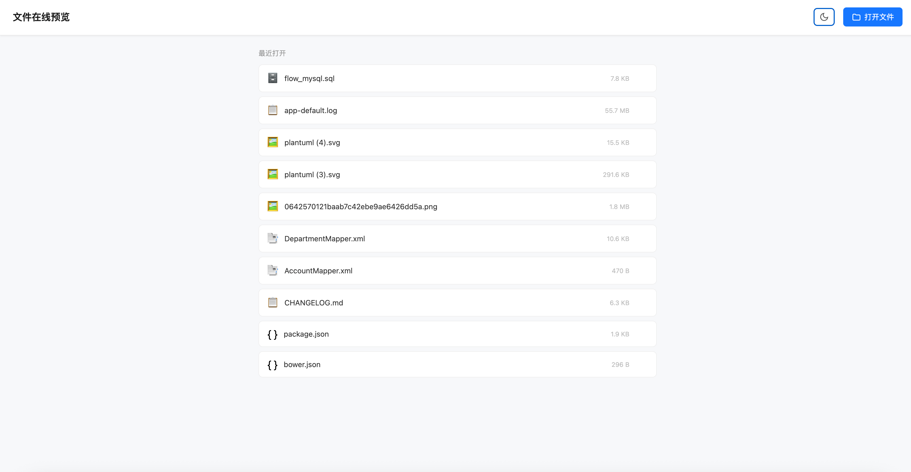
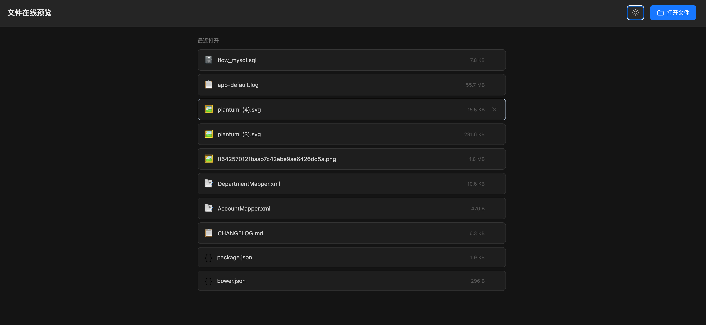
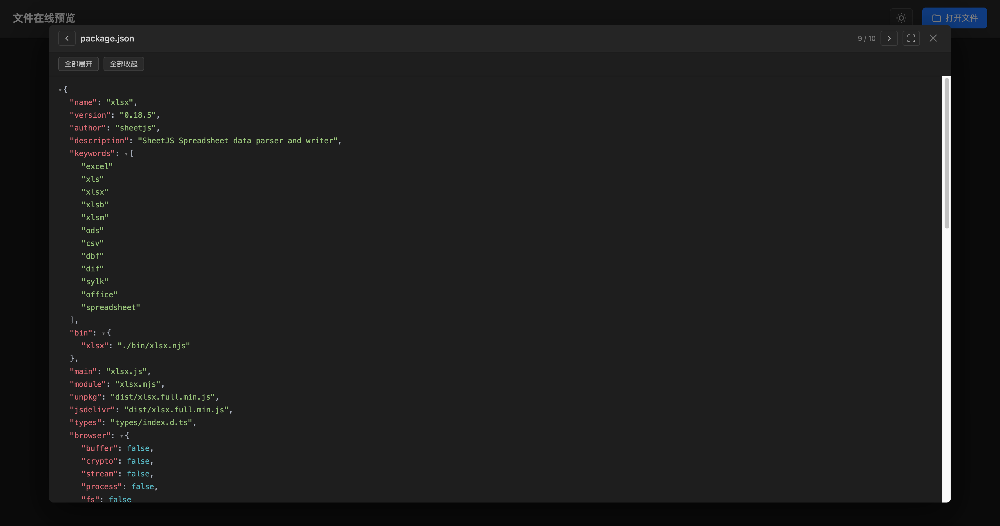
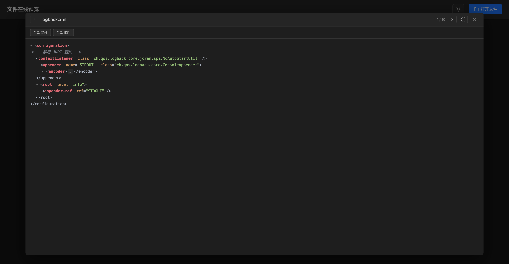
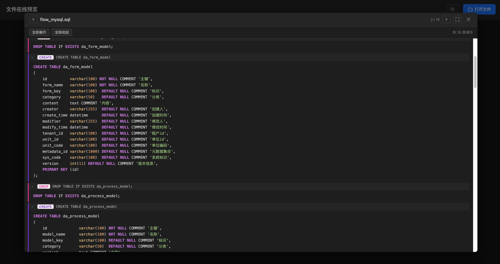
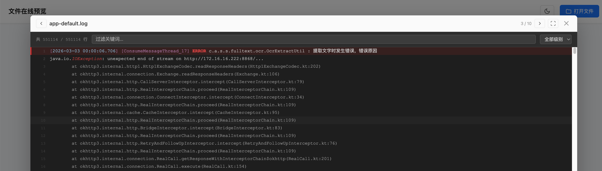
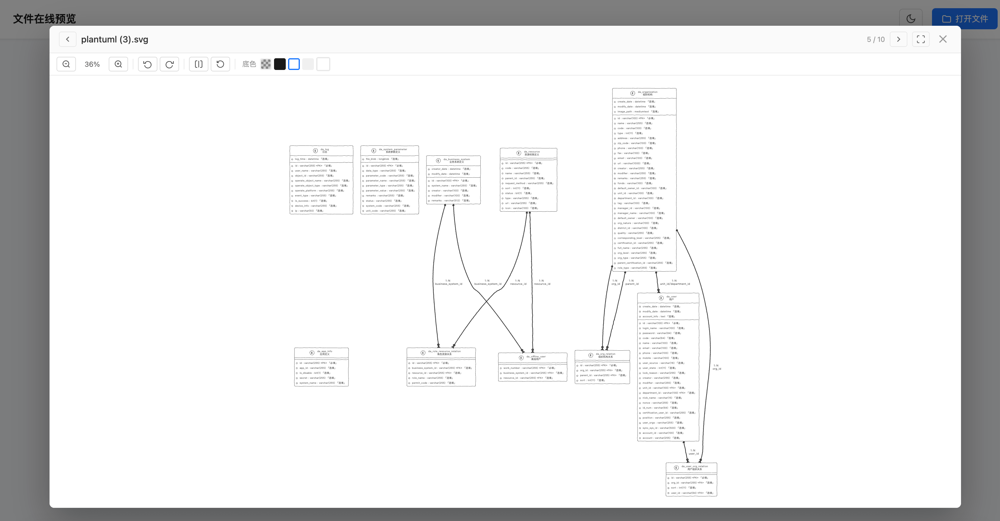
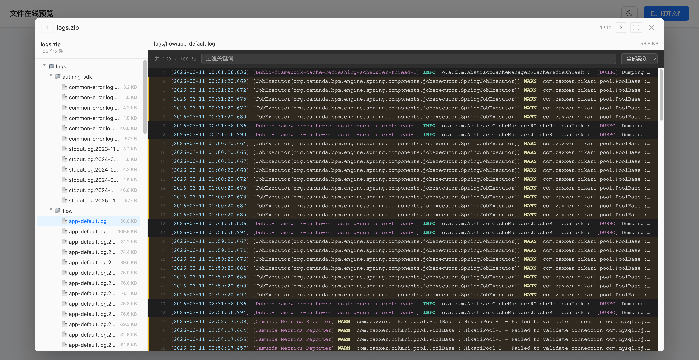
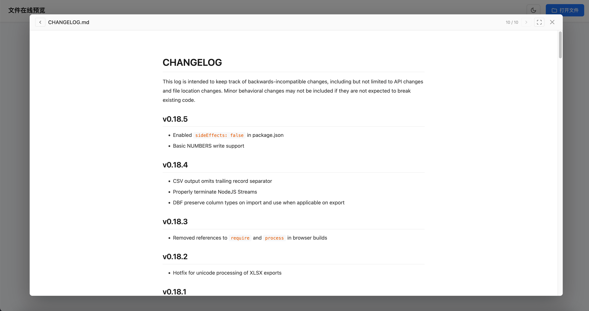
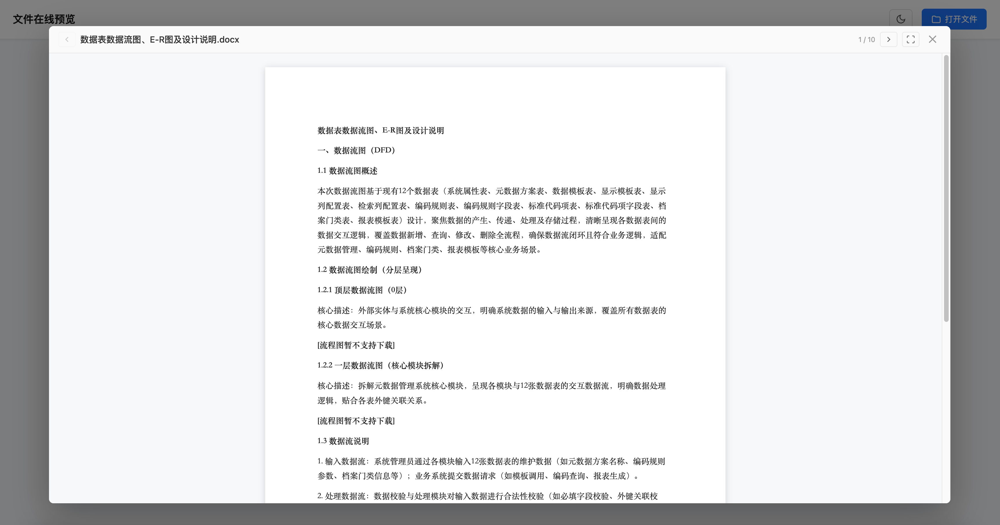

# File Preview

一个纯前端的本地文件预览工具，基于 Vue 3 + Vite 构建，支持多种文件格式的在线预览，无需后端服务，所有文件处理均在浏览器中完成。

## 支持的文件格式

| 类型 | 格式 |
|------|------|
| 文档 | PDF、Word（.doc/.docx）、Excel（.xls/.xlsx）、PPT（.ppt/.pptx）、OFD |
| 代码 | JSON、XML、SQL、HTML、YAML、Properties、JS/TS、CSS、Vue、Java、Shell、Bat |
| 文本 | TXT、CSV、Markdown（.md）、Log |
| 图片 | PNG、JPG、GIF、SVG、WebP、BMP、HEIC/HEIF、EMF、WMF |
| 音视频 | MP3、WAV、OGG、FLAC、AAC、MP4、WebM、MOV、AVI 等 |
| 压缩包 | ZIP、RAR、7Z、JAR、WAR、APK、TAR、GZ、TGZ |
| 其他 | Java .class 反编译、OFD |

## 功能特性

**文件管理**
- 点击「打开文件」选择本地文件，或直接拖拽文件到页面
- 支持 URL 远程文件预览，自动识别文件类型
- 最近打开的文件自动缓存到 IndexedDB（最多 10 个），刷新页面后自动恢复
- 预览界面支持左右箭头切换文件，键盘 `←` `→` 同样有效

**预览界面**
- 亮色 / 暗色主题切换
- 全屏预览，按 `F11` 或点击工具栏按钮切换
- 内容搜索（`Ctrl+F`），关键词高亮、上下翻查，亮色/暗色主题下高亮颜色自动适配
- 文件下载按钮

**图片预览**
- 支持 HEIC/HEIF 格式（浏览器端自动转换）
- 缩放（滚轮 / 按钮 / `+` `-` 键）、旋转、水平翻转、拖拽平移
- 背景底色切换：棋盘格（透明）、深色、白色、浅灰、自定义颜色
- EMF/WMF 矢量图手写解析器渲染，支持多边形、贝塞尔曲线、折线、文字、嵌入位图等

**Excel 预览**
- 虚拟滚动，万行数据流畅渲染
- 多 Sheet 按需解析，切换时才加载
- 关键词过滤（防抖）和列排序

**JSON / XML 预览**
- 树形结构渲染，支持节点折叠 / 展开、一键全部展开 / 收起
- 语法高亮，亮色 / 暗色主题自动适配

**SQL 预览**
- 按语句块拆分，每条语句可单独折叠
- 类型徽标颜色区分（SELECT / INSERT / UPDATE / DELETE / CREATE 等）

**Log 预览**
- 虚拟滚动，支持百万行大文件不卡顿
- 自动识别 ERROR / WARN / INFO / DEBUG / TRACE 级别并高亮
- 关键词过滤 + 级别筛选

**压缩包预览**
- 左侧文件树浏览压缩包内容
- 右侧按文件实际格式渲染，支持包内 Excel、Word、PDF、图片、代码、JSON 等所有已支持格式
- 自动识别文件名编码，兼容 UTF-8 和 GBK（Windows 旧版压缩工具中文文件名）

## 快速开始

```bash
npm install
npm run dev
```

构建生产版本：

```bash
npm run build
```

## 键盘快捷键

| 快捷键 | 功能 |
|--------|------|
| `←` / `→` | 切换上一个 / 下一个文件 |
| `Esc` | 关闭预览 |
| `F11` | 切换全屏 |
| `Ctrl+F` | 打开搜索 |
| `Enter` / `Shift+Enter` | 搜索下一个 / 上一个 |
| `+` / `-` | 图片放大 / 缩小 |
| `R` | 图片向右旋转 |
| `0` | 图片重置变换 |

## 截图

| 主页（亮色） | 主页（暗色） |
|---|---|
|  |  |

| JSON 预览 | XML 预览 |
|---|---|
|  |  |

| SQL 预览 | Log 预览 |
|---|---|
|  |  |

| 图片预览 | 压缩包预览 |
|---|---|
|  |  |

| Markdown 预览 | Word 预览 |
|---|---|
|  |  |

## 技术栈

- [Vue 3](https://vuejs.org/) + TypeScript
- [Vite](https://vitejs.dev/)
- [docx-preview](https://github.com/VolodymyrBaydalka/docx-preview) — Word 渲染
- [pptx-preview](https://github.com/meshesha/pptx-preview) — PPT 渲染
- [ofd-tools](https://github.com/DLillard0/ofd-tools) — OFD 渲染
- [highlight.js](https://highlightjs.org/) — 代码语法高亮
- [marked](https://marked.js.org/) — Markdown 渲染
- [@zip.js/zip.js](https://gildas-lormeau.github.io/zip.js/) — ZIP/压缩包解析
- [xlsx](https://sheetjs.com/) — Excel 解析
- [heic2any](https://github.com/alexcorvi/heic2any) — HEIC 格式转换

## 隐私说明

所有文件均在本地浏览器中处理，不会上传到任何服务器。
